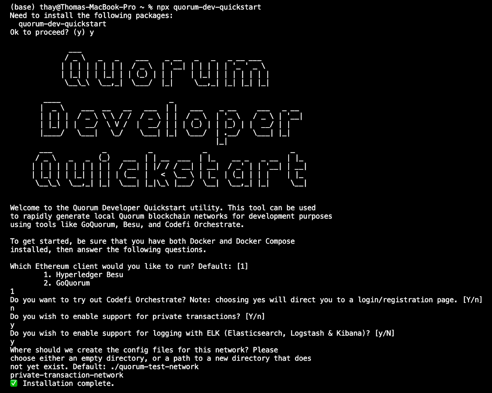

# Pré-requisitos

## Os usuários do Windows devem primeiro:

- Download and install ["Windows Subsystem for Linux 2"](https://consensys.net/blog/developers/ethereum-developers-guide-to-setting-up-windows-subsystem-for-linux/)
  
- Download and install  ["Docker Desktop configured to use the Windows Subsystem for Linux 2 engine"](https://docs.docker.com/docker-for-windows/wsl/).


## Todos os usuários precisarão de:

- Download and install  ["Docker Compose"](https://docs.docker.com/compose/install/)
- Download and install ["Node.js"](https://nodejs.org/en/download/)

## Comandos úteis:

```bash
npx quorum-dev-quickstart
```

Depois de executar o início rápido, você verá os seguintes prompts na linha de comando. Para este exemplo, você escolherá as seguintes opções quando solicitado:

```bash
Which Ethereum client would you like to run? Default: [1]
        1. Hyperledger Besu
        2. GoQuorum
1
Do you want to try out Codefi Orchestrate? Note: choosing yes will direct you to a login/registration page. [Y/n]
n
Do you wish to enable support for private transactions? [Y/n]
y
Do you wish to enable support for logging with ELK (Elasticsearch, Logstash & Kibana)? [y/N]
y
Where should we create the config files for this network? Please
choose either an empty directory, or a path to a new directory that does
not yet exist. Default: ./quorum-test-network
private-transaction-network
```

Abaixo, você pode ver como a saída do Quorum Developer Quickstart se parece:




#### Isso criará um novo diretório em sua máquina chamado private-transaction-network. 

O diretório padrão que será criado para armazenar esses arquivos será denominado quorum-test-network, mas o renomeamos no exemplo.


Altere seu diretório para private-transaction-network usando o comando:

```bash
cd private-transaction-network
```

Digite o comando:

```bash
open README.md
```

Isso abrirá o README e seguiremos especificamente as instruções na Seção ii. ["Rede POA com privacidade  disponível no GitHub"](https://github.com/ConsenSys/quorum-dev-quickstart/blob/master/files/besu/README.md#poa-network-privacy) (ConsenSys/quorum-dev-quickstart).

