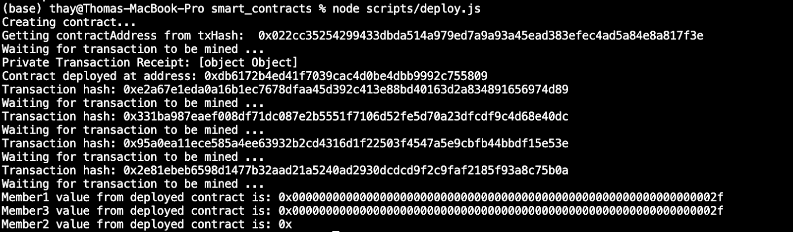

# Pré-requisitos:

## O Quickstart foi instalado conforme descrito na lição anterior.

### Comandos úteis:

Vamos navegar até a pasta smart_contracts usando o comando:

```bash
cd smart_contracts
```

Execute os comandos:

```bash 
npm install
node scripts/deploy.js
```

que implantará o contrato inteligente EventEmitter.sol que está na pasta de contratos e enviará uma transação privada de Member1 para Member3 da rede. A transação privada, neste exemplo, é o envio de um valor de Member1 para Member3. Se olharmos dentro do script deploy.js, veremos que o valor enviado de Member1 para Member3 é 47 (consulte a linha 89 dentro do arquivo deploy.js).

Abaixo você pode ver como a saída do exemplo de transação privada se parece:




Observando esta saída no terminal, ocorreu o seguinte.

- 1. O contrato inteligente EventEmitter.sol foi migrado e implantado em nossa rede. Isso é confirmado pelas seguintes saídas:

```bash 
Getting contractAddress from txHash: 0x022cc35254299433dbda514a979ed7a9a93a45ead383efec4ad5a84e8a817f3e
Waiting for transaction to be mined ...
Private Transaction Receipt: [object Object]
Contract deployed at address: 0xdb6172b4ed41f7039cac4d0be4dbb9992c755809
```

- 2. Depois que o contrato EventEmitter.sol foi implantado, Member1 enviou uma transação privada para Member3. Member1 e Member3 podem ver o valor dentro da transação, que foi hash, como:

```bash 
Member1 value from deployed contract is:
0x000000000000000000000000000000000000000000000000000000000000002f
Member3 value from deployed contract is:
0x000000000000000000000000000000000000000000000000000000000000002f
```

- 3. Member2, que não foi incluído na transação privada, não consegue ver esse valor e obtém um valor retornado de 0x.

```bash
Member2 value from deployed contract is: 0x
```

O que foi demonstrado aqui é que dois Membros podem enviar transações entre si, e outros membros não podem observar o conteúdo da transação.

Para obter mais informações, consulte a documentação do Hyperledger Besu, ["web3js-eea"](https://besu.hyperledger.org/en/1.4.3/Reference/web3js-eea-Methods/).